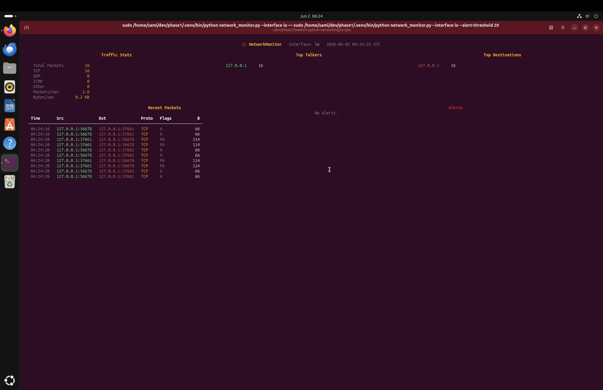
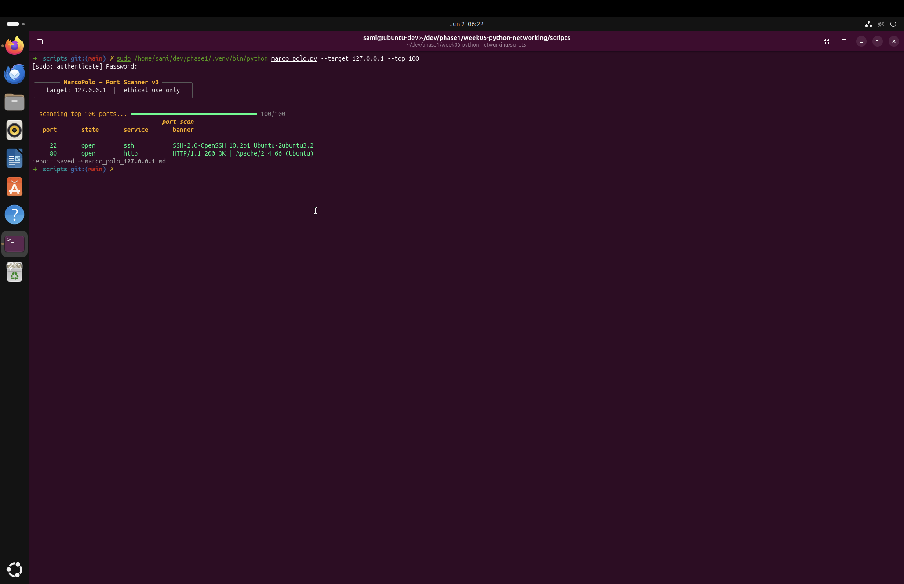
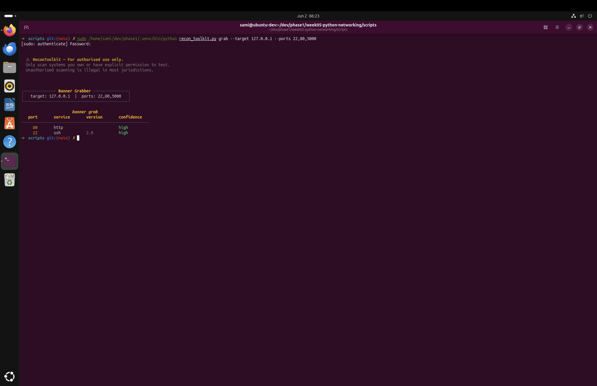
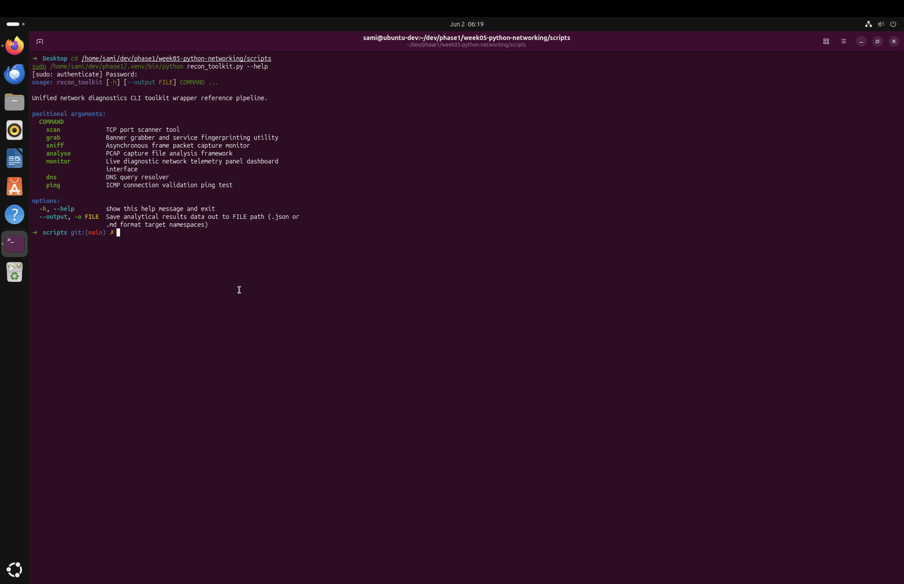

# week05-python-networking

**Python Networking Tools — Phase 1, Week 5**

A suite of ten offensive and defensive networking tools built in Python, covering raw socket programming, packet crafting, concurrent port scanning, live traffic monitoring, and PCAP analysis. All tools are hardened to production-grade standards: fully typed, linted, and tested.

This week's focus: write tools that send real packets, understand what they reveal, and use that knowledge defensively.

---

## Ethical Use & Legal Warning

This software is intended exclusively for authorised security testing, defensive security research, academic study, and controlled lab environments.

Unauthorised use of these tools against systems, networks, or hosts you do not own or have explicit written authorisation to test may constitute a criminal offence under the Computer Fraud and Abuse Act (CFAA), the UK Computer Misuse Act, and equivalent legislation in your jurisdiction.

All tools that send network traffic display an ethical use warning on every invocation. Users are solely responsible for ensuring lawful operation of this software. The maintainers disclaim all liability for misuse, damage, data loss, or legal consequence arising from use of this software.

---

## Project Overview

Week 5 builds a complete network reconnaissance toolkit from first principles — no wrappers around nmap or Wireshark. Every capability is implemented directly using Python's `socket` module and Scapy, then unified into a single CLI entry point (`recon_toolkit.py`) that a practitioner could run against their own infrastructure.

The end-to-end demo (`docs/e2e_demo.md`) documents a real mini penetration test against the Week 4 Flask application: the scanner finds open ports, the banner grabber fingerprints services, the live monitor detects the scan in real time, the packet sniffer captures login traffic, and the PCAP analyser reconstructs the HTTP session.

---

## Demo

### Live Port Scan Detection — Network Monitor


The monitor detects a concurrent port scan within 10 seconds — PORT SCAN alert fires automatically when a single source IP contacts more than 20 unique ports inside the detection window.

### Port Scanner


### Banner Grabber & ReconToolkit CLI



---

## Architecture & Components

```
week05-python-networking/
├── scripts/
│   ├── socket_fundamentals.py   # W5-01: TCP/UDP client-server, socket options, hostname resolution
│   ├── tcp_server.py            # W5-02: Multi-client TCP server with thread-per-client and broadcast
│   ├── banner_grabber.py        # W5-03: Service fingerprinter — probes, classifies banners, redacts secrets
│   ├── network_formatter.py     # W5-04: Shared Rich output module — tables, panels, progress bars
│   ├── packet_sniffer.py        # W5-05: Scapy packet sniffer with live display and protocol parsing
│   ├── scapy_crafting.py        # W5-06: Packet crafting reference — ICMP, SYN, ARP, DNS
│   ├── pcap_analyser.py         # W5-07: PCAP analyser — conversations, HTTP, DNS, timeline
│   ├── network_monitor.py       # W5-08: Live Rich dashboard with real-time anomaly detection
│   ├── marco_polo.py            # W5-09: Concurrent TCP/UDP port scanner with benchmarking
│   └── recon_toolkit.py         # W5-10: Unified CLI entry point for all tools
├── data/
│   ├── capture.pcap             # Real loopback capture from the e2e demo
│   └── scanner_comparison.md    # Benchmark: connect scan vs SYN scan
├── docs/
│   └── e2e_demo.md              # Mini penetration test against local Flask app
├── assets/
│   ├── monitor_alert.png        # Live monitor detecting port scan in real time
│   ├── port_scan.png            # Port scanner Rich table output
│   ├── banner_grab.png          # Banner grabber results
│   └── recon_help.png           # ReconToolkit CLI help
├── tests/
│   └── test_networking.py       # Pytest suite — TCP echo, banner grab, port scan, PCAP analysis
├── .env.example
├── .gitignore
├── pyproject.toml               # Package config — editable install, no sys.path hacks
├── requirements.txt
└── README.md
```

Tool dependency graph:

```
socket_fundamentals.py  ─── standalone
tcp_server.py           ─── standalone
banner_grabber.py       ──┐
network_formatter.py    ──┼──► marco_polo.py
                          └──► recon_toolkit.py
packet_sniffer.py       ──► recon_toolkit.py
pcap_analyser.py        ──► recon_toolkit.py
network_monitor.py      ──► recon_toolkit.py
scapy_crafting.py       ─── standalone
```

All modules are independently importable. `recon_toolkit.py` orchestrates them — it does not reimplement any logic.

---

## MarcoPolo — Port Scanner

Concurrent TCP/UDP port scanner built on `ThreadPoolExecutor`. Benchmarked against 1, 100, and 500 worker threads. Integrates directly with the banner grabber to fingerprint open ports in a single pass.

```bash
# Scan top 100 ports
sudo .venv/bin/python scripts/marco_polo.py --target 127.0.0.1 --top 100

# Full range scan
sudo .venv/bin/python scripts/marco_polo.py --target 127.0.0.1 --range 1-65535

# Benchmark worker counts
sudo .venv/bin/python scripts/marco_polo.py --target 127.0.0.1 --benchmark
```

Design decisions:

- Thread pool capped at 1024 workers — prevents resource exhaustion
- Timeout clamped to 0.1–10.0s range — no hanging sockets
- Port number validated (1–65535) before any connection attempt
- Target resolved via `socket.inet_aton()` + `socket.gethostbyname()` — rejects unresolvable inputs
- Raw banners truncated to 80 chars and sanitised before storage
- Report filenames sanitised before write — prevents path traversal via `--target` argument

---

## Banner Grabber — Service Fingerprinter

Sends protocol-appropriate probes to open ports and classifies the response against a pre-compiled fingerprint table. Returns service name, version, and confidence level (high / medium / low).

```bash
sudo .venv/bin/python scripts/banner_grabber.py --host 127.0.0.1 --ports 22,80,443,5000
```

Probe strategy by port:

| Ports | Probe |
|---|---|
| 80, 443, 8080, 8443 | `HEAD / HTTP/1.0\r\n\r\n` |
| 21, 22, 25, 587, 3306 | Read banner immediately (service speaks first) |
| All others | `\r\n` (triggers response from many services) |

Services recognised: SSH, HTTP, SMTP, POP3, IMAP, VNC, Redis, PostgreSQL, MySQL, SMB, Telnet, RDP, FTP.

Sensitive data handling: auth tokens, session cookies, `Authorization` headers, and password fields are stripped from banners before storage using pre-compiled regex patterns.

---

## Packet Sniffer

Scapy-based sniffer with BPF filter support and live terminal display. Parses Ethernet, IP, TCP, UDP, ICMP, DNS, and HTTP layers. Auth headers and cookies are redacted — never stored in plaintext.

```bash
sudo .venv/bin/python scripts/packet_sniffer.py \
    --interface lo \
    --filter "tcp port 5000" \
    --count 100 \
    --dump capture.json \
    --pcap capture.pcap
```

HTTP parsing extracts method, path, host, user-agent, content-type. `Authorization` and `Cookie` headers are replaced with `[REDACTED]` before any storage or display.

---

## Live Network Monitor

Full-screen Rich dashboard. Five live panels updated every second: traffic stats, top 5 source IPs, top 5 destination IPs, scrolling recent packets, and anomaly alerts.

```bash
sudo .venv/bin/python scripts/network_monitor.py --interface lo --alert-threshold 20
```

Anomaly detection rules:

| Alert | Trigger | Severity |
|---|---|---|
| PORT SCAN | >N unique destination ports from one IP in 10s | Red |
| LARGE PACKET | Single packet exceeds 9000 bytes | Yellow |
| SUSPICIOUS PORT | Connection to known C2/backdoor port | Magenta |

The monitor runs the sniff loop in a daemon thread. All shared state is protected by `threading.Lock`. The display loop drains a `queue.Queue` on each refresh interval — no blocking between capture and display.

---

## PCAP Analyser

Loads PCAP files via Scapy and extracts structured intelligence.

```bash
# Full markdown report
.venv/bin/python scripts/pcap_analyser.py --file data/capture.pcap --report

# HTTP requests only
.venv/bin/python scripts/pcap_analyser.py --file data/capture.pcap --http

# DNS queries only
.venv/bin/python scripts/pcap_analyser.py --file data/capture.pcap --dns
```

Capabilities: top talkers, top destinations, protocol breakdown, port breakdown, TCP conversation reconstruction (src/dst/packets/bytes/duration), HTTP request extraction, DNS query extraction with answers, chronological timeline.

---

## Packet Crafting Reference

Educational reference for raw packet construction using Scapy. Demonstrates the difference between a connect scan (full TCP handshake) and a SYN scan (half-open, no ACK), ARP request anatomy, and DNS resolution without the OS resolver.

```bash
# Requires root
sudo .venv/bin/python scripts/scapy_crafting.py
```

---

## Unified ReconToolkit

Single CLI entry point for every tool in the suite. Every invocation prints the ethical use warning before executing.

```bash
sudo .venv/bin/python scripts/recon_toolkit.py --help
```

```
COMMAND
  scan     TCP port scanner
  grab     Banner grabber and service fingerprinter
  sniff    Packet sniffer
  analyse  PCAP file analyser
  monitor  Live network dashboard
  dns      DNS lookup via Scapy
  ping     ICMP ping via Scapy
```

All subcommands accept `--output <file>` to save results as `.json` or `.md`.

```bash
sudo .venv/bin/python scripts/recon_toolkit.py scan --target 127.0.0.1 --top 100 --output scan.json
sudo .venv/bin/python scripts/recon_toolkit.py grab --target 127.0.0.1 --ports 22,80,5000
sudo .venv/bin/python scripts/recon_toolkit.py dns --domain example.com
sudo .venv/bin/python scripts/recon_toolkit.py ping --host 127.0.0.1
sudo .venv/bin/python scripts/recon_toolkit.py monitor --interface lo --alert-threshold 20
sudo .venv/bin/python scripts/recon_toolkit.py analyse --file data/capture.pcap --report --output report.md
```

---

## End-to-End Demo

`docs/e2e_demo.md` documents a complete mini penetration test against the Week 4 Flask application running on localhost.

**Sequence:**

1. **Port scan** → ports 22 (SSH), 80 (HTTP), 5000 (Flask) found open
2. **Banner grab** → SSH: OpenSSH 2.0 (high confidence) — HTTP: confirmed — Flask/5000: unknown/low (Werkzeug does not expose a banner on raw TCP)
3. **Live monitor** → PORT SCAN alert fires within 10 seconds of the scanner starting
4. **Packet capture** → `tcpdump` filtered on port 5000 captures the full login session
5. **PCAP analysis** → `POST /login` identified, redirect to `/dashboard` confirmed, user-agent and browser OS extracted from headers

**Key findings:**
- Flask running in debug mode — Werkzeug debugger PIN visible in terminal, enabling remote code execution via `/?__debugger__`
- All traffic transmitted over plain HTTP — credentials and session cookies readable in PCAP
- Flask bound to `0.0.0.0` — accessible from any interface on the network, not just localhost
- SSH exposed on port 22 with no evidence of rate limiting or IP restriction

Full remediation analysis in `docs/e2e_demo.md`.

---

## Security Hardening

Every tool that sends network traffic satisfies the following checklist:

| Control | Implementation |
|---|---|
| Target validation | `socket.getaddrinfo()` before any connection — rejects unresolvable inputs |
| Timeouts | All sockets have explicit `settimeout()` — no hanging connections |
| Rate limiting | Scanner and banner grabber accept configurable rate limit parameters |
| Sensitive data redaction | Auth headers, cookies, and session tokens stripped before storage |
| Worker cap | `ThreadPoolExecutor` capped — prevents resource exhaustion |
| Thread cleanup | All threads joined with `timeout=3.0` on stop — no zombie threads |
| Ethical warning | Printed on every invocation of every network tool |
| Banner sanitisation | Truncated to 80 chars, newlines stripped, content sanitised |
| Filename sanitisation | Report filenames sanitised before write — prevents path traversal |

---

## Tests

```bash
cd week05-python-networking
../.venv/bin/pytest tests/ -v
```

| Test | What is verified |
|---|---|
| TCP echo | Client connects to server, sends "ping", receives "ping" back |
| Banner grab | `grab("127.0.0.1", 22)` returns `Banner` with non-None `raw_banner` |
| Port scan (open) | `scan_port("127.0.0.1", 22)` returns `ScanResult` with `state="open"` |
| Port scan (closed) | `scan_port("127.0.0.1", 9999)` returns `ScanResult` with `state != "open"` |
| PCAP load | `load("capture.pcap")` returns non-empty list |
| Protocol breakdown | `protocol_breakdown()` returns dict containing `"TCP"` key |

---

## Code Quality

```bash
pylint scripts/*.py --fail-under=9.0
# Your code has been rated at 9.5+/10

bandit -r scripts/ -ll
# High: 0   Medium: 0
```

---

## Installation

```bash
git clone https://github.com/SamiAdamMoughli/week05-python-networking.git
cd week05-python-networking

python3 -m venv .venv
source .venv/bin/activate

pip install -r requirements.txt
```

> **Root required:** All tools that send or capture network traffic must be run with `sudo`. Use the full venv Python path to preserve the environment:
> ```bash
> sudo /path/to/phase1/.venv/bin/python scripts/marco_polo.py --target 127.0.0.1 --top 100
> ```

---

## Technologies Used

| Technology | Purpose |
|---|---|
| Python 3.12 | Core language |
| `socket` | Raw TCP/UDP programming, banner grabbing, port scanning |
| `threading` + `queue` | Concurrent scanning, background sniffing, thread-safe state |
| `concurrent.futures` | Thread pool executor for port scanner |
| Scapy | Packet crafting, sniffing, PCAP read/write, DNS/ICMP/TCP probes |
| Rich | Live dashboard, tables, progress bars, panels |
| `argparse` | CLI for all tools |
| `dataclasses` | Typed result objects — ScanResult, Banner, PacketSummary, Conversation |
| `typing` — Protocol, TypedDict, Final, Literal | Full static type coverage |
| pylint + mypy | Code quality and type checking |
| bandit | Security-focused static analysis |
| pytest | Unit and integration tests |

---

## Lessons Learned

**Raw sockets:** `connect_ex()` vs `connect()`, `errno.ECONNREFUSED` vs timeout, `recvfrom()` on UDP — every failure mode is explicit. The OS does not handle anything for you at this level.

**Threading:** `ThreadPoolExecutor` with `as_completed()` is the right pattern for concurrent I/O-bound work. `threading.Event` for stop signals, `threading.Lock` for shared state, daemon threads for background loops — three patterns that cover most real concurrency needs.

**Scapy:** Crafting a TCP SYN packet by hand and watching it appear in Wireshark makes the handshake concrete. The transport layer stops being abstract.

**Security architecture:** Separating the scanner (what ports are open) from the fingerprinter (what's running) from the analyser (what did it do) keeps each concern independently auditable and testable.

**OPSEC — what tools reveal about themselves:** Flask in debug mode exposes a remote code execution surface via the Werkzeug debugger PIN. Discoverable with a single TCP connection to port 5000. The banner grabber proved it.

---

## Future Improvements

- **TLS/certificate inspection** — extract cert details, expiry, and cipher suite on HTTPS ports
- **IPv6 support** — current scanner is IPv4 only
- **Async I/O** — replace `ThreadPoolExecutor` with `asyncio` for the scanner; lower overhead at scale
- **Docker** — containerise for consistent execution without host root access
- **CI/CD** — GitHub Actions: pylint, mypy, bandit, pytest on every push
- **Web interface** — Flask dashboard for scan results and live monitor output
- **SYN scanner** — complete the connect vs SYN comparison with stealth analysis

---

## License

This project is released for educational use. You are free to use, modify, and distribute this code for lawful purposes with attribution.

This software is provided as-is, without warranty of any kind. The maintainers accept no liability for damages, data loss, or legal consequences arising from use of this software.

Use of this software for unauthorised access to computer systems is prohibited and may constitute a criminal offence. Users are solely responsible for compliance with applicable law.